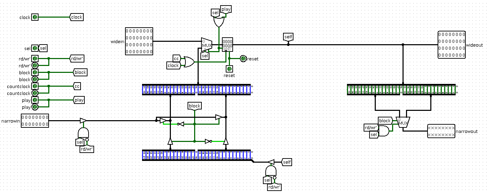

# General design

This project is a realization of Conways' Game Of Life, built on:
- CdM-16 as a konzertmeister of all work, language processor, which translates human-readable command lines from terminal to some instructions for theese devices (or prints an error to terminal with understandable explanation of an error).
- [UART](https://github.com/cdm-processors/logisim-uart) (and UART controller built around it) as a main way of communicating with external terminal for implementation of the CLI.
- Matrix controller as a device, that makes game work and implements a low-level interface for modification of rules, speed of game, game field and controling game flow (run game, pause it or make one itaration)

The core idea behind the division of responsibilities between CdM-16 and peripheral devices is ability of each peripheral device to work independatly, parallel to each other:
- Matrix controller can run game, while processor is always ready to receive and parse users' input without stopping the game, write an error, saying that processor cannot modify some part of game state while game is running, or actually modify some part of state, which can be modified anytime (like speed of game or pausing it).
- UART can receive and store data in its' own buffer without any actions from processor, independently, and hold it until processor read it.
# Hardware
## Memory mapped I/O
## Interrupt Arbiter
## Interrupt bus
## Matrix controller

Matrix controller consist of two main parts:
- Matrix buffer - main sequential unit, which stores current game field state and can be modified by processor or by game processor.
- Game processor - main combinatory unit, which calculates next field state based on current and on rules.
- Other auxiliary devices, wich will be described later.
### Matrix buffer row

Here we have 32-bit register, holding state of one row of field and bunch of infrasctructure for modifying it and for reading its' data. 

Act of writing to this register can be triggered by rising edge of clock (so it will be synchronized with processor) or by rising edge of cc (counter clock) either (so it will be synchronized with game processor).
### Matrix buffer
### Cell
#### Counter
### Game processor row
### Game processor
### Speed controller
### Status register
### One iteration trigger
## UART controller
# Software
## Memory layout

- Addresses 0xff00-0xffff - I/O devices address space
	- Addresses 0xff80-0xffff - game field (for reading and writing of current field state 16 bits at a time) 
	- Address 0xff7e - matrix controller state register №1
	- Address 0xff7c - matrix controller state register №2
	- Address 0xff7a - UART controller (for reading and writing data via UART) 
	- Address 0xff78 - address for controlling of interrupts throwing from UART controller
	- Address 0xff76 - address for triggering one game tick
- Addresses 0xfee1 - 0xfeff - input buffer
## Interrupt Vector Table (IVT)
## Start section
## Matrix Driver
## Interrupt handlers
## Main section
## Commands list
## Commands parsing
# User guide

Перевести и распределить по разделам
|
V

# Регистры состояния поля

- Регистр 1
	- 0-8 биты битовая строка настройки survive
- Регистр 2
	- 0-8 биты битовая строка настройки born
	- 9 бит play
	- 10 бит reset
	- 11-12 биты speed, 0 самая быстра, 3 - самая медленная

# Прерывания

- Произошло подключение - прерывание, печатаем приветственное сообщение и приглашение
- Пришли данные - прерывание, считываем одну строчку данных, парсим её, выполняем команду/печатаем ошибку. Читаем информацию о СТАТУСЕ UART'a из какого то отдельного регистра статуса для UART'a, если там информация о том, что данных больше нет - печатаем приглашение в терминал, встаём в wait. Если есть ещё строчки на обработку - запускаем обработчик прерывания снова.
