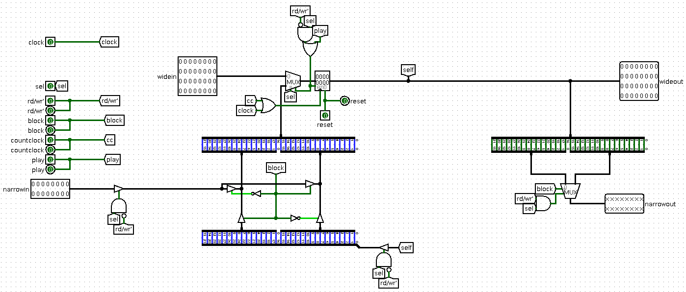
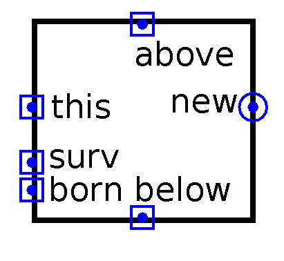
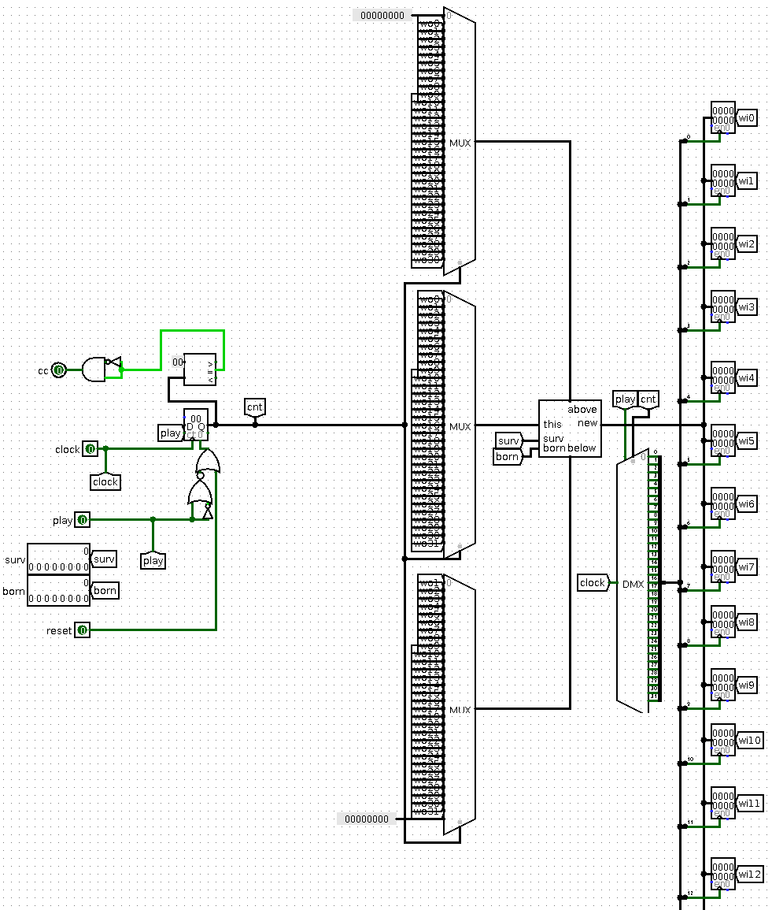
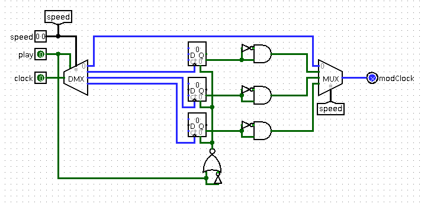

# General design

This project is a realization of Conways Game Of Life, built on:

- CdM-16 as a konzertmeister of all work, language processor, which translates human-readable command lines from terminal to some instructions for theese devices (or prints an error to terminal with understandable explanation of an error).
- [UART](https://github.com/cdm-processors/logisim-uart) (and UART controller built around it) as a main way of communicating with external terminal for implementation of the CLI.
- Matrix controller as a device, that makes game work and implements a low-level interface for modification of rules, speed of game, game field and controling game flow (run game, pause it or make one itaration)

The core idea behind the division of responsibilities between CdM-16 and peripheral devices is ability of each peripheral device to work independently, parallel to each other:

- Matrix controller can run game, while processor is always ready to receive and parse users input without stopping the game, write an error, saying that processor cannot modify some part of game state while game is running, or actually modify some part of state, which can be modified anytime (like speed of game or pausing it).
- UART can receive and store data in its own buffer without any actions from processor, independently, and hold it until processor read it.

# Hardware
## Memory mapped I/O
## Interrupt Arbiter

The arbiter has four states it can be in:

1. **Zero** - the device does not require interrupts, or it does, but at the moment another device has not finished transmitting its interrupt request.
	In this state:

	If the device does not require an interrupt, then the IRQ and IAck pass through the arbiter from east to west and from west to east (it should be noted that if the processor is in the **WAITING** status, its raising of IAck is not considered as a response to the interrupt request, since being in this state, having received an interrupt request, the processor will only return to the **RUNNING** status, but will not process the request, the request will be processed after the transition to the **RUNNING** status)

	If the device requires an interrupt, but the other device has not finished transmitting its request, then the IAck output in the east cannot be raised again, but can be lowered (its high level indicates that the other device is transmitting its request)

	The transition from this state to the first is carried out provided that the device requires an interrupt and no other device is transmitting an interrupt request.
2. The **first** is sending an interrupt request from the device.
	In this state:

	The IRQ to the west and IAck to the east are blocked, while the arbiter holds the IRQ output to the west at a high level, signaling the processor that an interrupt is required

	The transition from this state to the second is carried out provided that the processor has responded to the request by raising IAck (which means that the processor state allows the interrupt to be processed)
3. **Second** - transfer of the interrupt vector to the processor
	In this state:

	The arbiter still holds the IRQ at a high level, since its lowering will lead to the termination of the interrupt request transfer process (unlike CdM-8, in which a fall in IRQ will cause a fall in IAck, which will trigger the interrupt vector latch in the processor, CdM-16 latches the interrupt vector on the falling edge of the clock, provided that there is an interrupt request and the necessary conditions inside the processor). In this case, the interrupt vector from the device is fed to the interrupt vector bus connected to the processor. Also, the raised IAck is transmitted to the device to notify it that the processor has responded to its request.

	The transition from this state back to zero and the completion of interrupt processing occurs on the falling edge of the clock, since it is at this moment that the processor latches the interrupt vector and the process of transmitting the request can be considered complete.

## Interrupt bus


Interrupt bus has two arbiters:

- The first arbiter for outputting a greeting message. It has a higher priority and causes an interrupt when a remote terminal connects, sending a **con** signal.
- The second arbiter for processing commands. It has a lower priority and causes an interrupt when a command arrives in the UART buffer, sending a **dt** signal. In order to be able to process several commands that arrive one after another or one while the second is being read, a special address is used that sends a signal that the command reading has been completed.

## Matrix controller

Matrix controller consist of two main parts:

- Matrix buffer - main sequential unit, which stores current game field state and can be modified by processor or by game processor.
- Game processor - main combinatory unit, which calculates next field state based on current and on rules.
Other auxiliary devices, will be described later.

### Matrix buffer row



Here we have 32-bit register, holding state of one row of field and infrasctructure for modifying it and for reading its data. 

This register is enabled only if this row is **selected** as a distination of writing act of processor or if the game is **running**. Reasons of it is obvious, we don't need to change anything when the game paused and if processor isn't writing to this row.

Act of writing to this register can be triggered by rising edge of **clock** (so it will be synchronized with processor) or by rising edge of **cc** (counter clock) either (so it will be synchronized with game processor).

Also, because two sources of new state of this row (processor and game processor) changes different amount of bits in state at time (processor changes only first or second 16 bits of state due to size of data bus, game processor can change all 32 bits at time) there is two inputs in this circuit:

- **Narrow in** - input from data bus of processor. This source is closed (by controlled buffer) when it's not needed (when there is no writing to this row from processor) same as **self** - current state of row, which needed for replacing one half of it while keeping another half unchanged (depends on **block** input, 0 - most significant bits, 1 - least significant bits).
- **Wide in** - input from game processor (new state of this row, calculated by game processor). This source goes straight to the multiplexer.

Which source of new state to use selects multiplexer in the west of register. It's disabled, when register is disabled, and when it's enabled, it selects source depend on **sel** input, if **sel** is high, this mean, that we need to take new state from processor, from **narrow in** combined with current state, when **sel** is low, we need to take new state from game processor, from **wide in**.

Respectively, in the east side of circuit we have two outputs:

- **Narrow out** - output to data bus of processor. Row will pass its first or second half on this buss (depends on **block** again) if processor reads data from this row, otherwise it won't pass anything.
- **Wide out** - output to game processor. Row always pass its current state to let game processor calculate its new state if game is running.

Also, in the west side of circuit we can see, that some of inputs goes straight to output, named same as an input. This needed to pass some signals through all of rows, then they stay one above another (we will see it in next section).

This is how this circuit looks in other circuits:


Here we have all of described inputs and outputs labeled.
### Matrix buffer


Here we have 32 **matrix buffer rows**, connected with each other in one big block - matrix buffer. All **narrow ins** connected to one narrow in input in the south of circuit, which connected to data bus. Also, all **narrow outs** connected to one narrow out output, connected to data bus.

Where is decoder for selecting appropriate row by address and demultiplexer to pass clock signal only to the row, which selected.

All of wide inputs connected to 32 separate 32 bit inputs and all of wide outputs connected to 32 separate 32 bit outputs.

Here is matrix buffer appearence:


### Cell


Cell is a single calculator, which calculates new state of single cell, based on its neighbours (actually on amount of alive neighbours), current status of cell and rules.

This is done by two multiplexers, selecting if cell should survive or should it become alive, and CNF, which represents following truth table:

| surv | born | state | new |
| ---- | ---- | ----- | --- |
| 0    | 0    | 0     | 0   |
| 0    | 0    | 1     | 0   |
| 0    | 1    | 0     | 1   |
| 0    | 1    | 1     | 1   |
| 1    | 0    | 0     | 0   |
| 1    | 0    | 1     | 1   |
| 1    | 1    | 0     | 1   |
| 1    | 1    | 1     | 1   |

#### Counter

Circuit in the west side is counter, simple circuit which counts amount of its high inputs:


### Game processor row


This circuit is just 32 cells connected with each other in one row. This circuit have 3 inputs for rows:

1. Row **above** this
2. Row **below** this
3. **This** row

All of this inputs is **current** state of this rows.
Also, there is 2 inputs for rules, mentioned before: **surv** and **born**.

All of cells 8 **neighbour** inputs connected to appropriate wires with their neighbours statuses (except leftmost and rightmost cells, which don't have neighbours on the left and on the right respectively).

All of calculated **new** states of cells goes in single 32 bit wide wire, which goes to the only one output of game processor row - **new state of this row**.

Here is appearence of game processor row:



### Game processor



Game processors purpose is to calculate new state of whole game field. New state is calculated, base on current, row by row. This is implemented by 32 bit counter, which indicates, which row will be calculated on this tick, and 3 multiplexers choosing appropriate **this** row, **above** row and **below** row for **game processor row** and 32 "buffering" registers, holding new state until it will be latched in matrix buffer.

Transition of counter value from 31 to 0 meaning, what all 32 row were calculated, causes rising of "equal" out of comparator (which compares counter value and 0), this triggers impulse on **cc** output and results in matrix buffer latching new state of whole game field.

Also, when game pauses, counter resets to zero, because we need to recalculate whole new game field state after (maybe) something will be changed when game is paused. 
### Speed controller



This simple circuit stays for regulating speed of game. When game is running it will choose the way, through which clock will go depends on speed input:

1. Directly 
2. Through counter, which (with rising edge detector, connected to carry output of counter) generates impulse every 2 ticks
3. Through counter, which generates impulse every 4 ticks
4. Through counter which generates impulse every 8 ticks

### Status register
### One iteration trigger
## UART controller


UART controller contains UART and I/O implementation.
- When the processor accesses an address allocated in memory, it writes a character to the UARTa buffer via the data bus or retrieves it from there via the data bus depending on the rd/wr signal.
- UART raises the **dt** signal if a character arrives in the buffer, and the **con** signal if a remote terminal is connected to the UART.
# Software
## Memory layout

- 0x0000 - 0x0080 - IVT
- 0xfc56 - SP initial value
- 0xfc56 - 0xfee0 - templates 
- 0xfee1 - 0xfeff - input buffer 
- 0xff00-0xffff - I/O devices address space
	- 0xff80-0xffff - game field (for reading and writing of current field state 16 bits at a time) 
	- 0xff7e - matrix controller state register №1
		- Bits 0-8 - bit string, representing survive rule
	- 0xff7c - matrix controller state register №2
		- Bits 0-8 - bit string, representing born rule
		- Bit 9 - play
		- Bit 10 - reset (write 1 to this bit, to reset field)
		- Bits 11-12 - speed
	- 0xff7a - UART controller (for reading and writing data via UART) 
	- 0xff78 - address for controlling of interrupts throwing from UART controller
	- 0xff76 - address for triggering one game tick

## Interrupt Vector Table (IVT)
## Start section

```
main: ext

rsect start

start>
        ldi r0, 0xfc56
        stsp r0

        jsr main
        
        halt

end
```

Start section with start function in it stays for preparing runtime (setting SP initial value) and calling main function.
## Matrix Driver

Functions:

1. setTo1
	- Arguments: **r0** - x, **r1** - y. Coordinates should be in range 0-31.
	- Sets cell with coordinates (x, y) to alive status
2. setTo0
	- Arguments: **r0** - x, **r1** - y. Coordinates should be in range 0-31.
	- Sets cell with coordinates (x, y) to dead status
3. setRectTo1
	- Arguments: **r0** - x1, **r1** - y1, **r2** - x2, **r3** - y2. Coordinates should be in range 0-31 and x1 <= x2, y1 <= y2.
	- Sets all cells in rectangle with upper left corner (x1, y1) and lower right corner (x2, y2) to alive status
4. setRectTo0
	- Arguments: **r0** - x1, **r1** - y1, **r2** - x2, **r3** - y2. Coordinates should be in range 0-31 and x1 <= x2, y1 <= y2.
	- Sets all cells in rectangle with upper left corner (x1, y1) and lower right corner (x2, y2) to dead status
5. startGame
	- Starts game
6. pauseGame
	- Pauses game
7. setSurv
	- Arguments: **r0** - bit string, representing survival rule. If bit number n (0-9) is 1, then alive cell with n alive neighbours will survive, otherwise it will die. All bits from 10th to 15th should be 0.
	- Sets rule "survive"
8. setBorn
	- Arguments: **r0** - bit string, representing born rule. If bit number n (0-9) is 1, then dead cell with n alive neighbours will becom alive, otherwise it remain dead. All bits from 10th to 15th should be 0.
	- Sets rule "born"
9. clear
	- Cleares game field
10. speedDown
	- Increments speed, which causes slowdown (because 0 - the fastest speed). If speed is 3, it will change to 0
11. speedUp
	- Decrements speed, which causes speed increae (because 0 - the fastest speed). If speed is 0, it will change to 3
12. setSpeed
	- Arguments: **r0** - speed value. Bits 0-1 - speed value, other bits should be 0.
	- Sets speed to specified value
13. stepOnce
	- Do one iteration of game

## Matrix Templates

Template structure:

- 1 word - header
	- bits 0 - 4 - width
	- bits 5 - 9 - height
- following 64 words - template

## Interrupt handlers
## Main section
## Commands list

1. `h` - print help message
2. `s1 x y` - set cell (x, y) to alive status
3. `s0 x y` - set cell (x, y) to dead status
4. `i x y` - invert status of (x, y) cell
5. `play` - run game
6. `pause` - stop game
7. `step` - make one iteration of game
8. `rules S<digits sequence>B<digits sequence>` - set rules
9. `su` - speed up
10. `sd` - speed down
11. `ss n` - set speed to n
12. `S1 x1 y1 x2 y2` -  Sets all cells in rectangle with upper left corner (x1, y1) and lower right corner (x2, y2) to alive status
13. `S0 x1 y1 x2 y2` -  Sets all cells in rectangle with upper left corner (x1, y1) and lower right corner (x2, y2) to dead status
14. `saveX x1 y1 x2 y2` - Save all cells in rectangle with upper left corner (x1, y1) and lower right corner (x2, y2) to slot number X
15. `loadX x y` - Copy all cells from slot X to rectangle with upper left corner (x1, y1)
16. `clr` - Clear game field

## Commands parsing

Functions:

1. **skipSpaces**
 - Argument: r0 - pointer to buffer's symbol
 - Skips all spaces from current symbol
2. **strncmp**
 - Arguments: r0 - pointer to buffer's symbol, r1 - pointer to command's symbol, r4 - number of symbols
 - Compares the first n symbols from the current symbol with a command of size n
3. **readUInt**
 - Arguments: r0 - pointer to buffer's symbol
 - Gets a number from the buffer from the current symbol

General algorithm for parsing:

- Call the skipSpaces function
- Compare with the command using strncmp
- Call skipSpaces again
- Then call skipSpaces and readUInt as needed

# User guide
